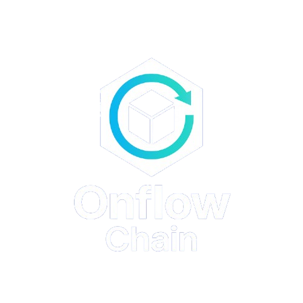

<div align="center">
  
  <h1>OnFlowChain — Stylus Gas-less Pay (Frontend)</h1>
  <p>Pagamentos em lote para Web3 • Até 90% de economia em gás • UX pronta para produção</p>
  <sub>Frontend Mini App (Next.js + MiniKit). Integra com backend Arbitrum Stylus (Rust/WASM) via REST.</sub>
</div>

---

## 1) Visão Geral

OnFlowChain é uma interface Mini App para folha de pagamento/airdrop em lote focada em eficiência de gás e simplicidade operacional.  
Este repositório contém apenas o frontend (Next.js + TypeScript + Tailwind + Shadcn UI + MiniKit + Zustand).

- Backend (Rust/WASM no Arbitrum Stylus) e API REST: https://github.com/Alisson-tech/payment-arbitrum-styles
- Objetivo: processar centenas de pagamentos em uma única execução com UX de aprovação simples (Upload CSV → Revisão → Confirmar pagamento).

> Importante: a versão atual do frontend roda 100% client-side para demo (mock de execução/estimativa). A integração com o backend acima é direta e documentada abaixo.

---

## 2) Contexto (Problema → Solução → Diferencial)

- A dor: taxas de gás drenam tesourarias de DAOs, jogos e startups. Pagar 100 pessoas em Solidity = 100 transações e 100 taxas.
- O problema: EVM tradicional não foi feito para pagamentos em lote com eficiência.
- A solução: Arbitrum Stylus com contratos em Rust/WASM operando loops altamente eficientes, reduzindo custo em até 90%.  
  A UI OnFlowChain empacota esse poder em um fluxo simples e auditável.

Resumo executivo: processamos centenas de pagamentos em uma única execução, mantendo segurança, compatibilidade EVM e experiência amigável (CSV → Aprovar → Pagar).

---

## 3) Arquitetura de Alto Nível

- Frontend: Next.js 15 (App Router), React 19, TypeScript, Tailwind CSS, Shadcn UI, MiniKit (Farcaster Mini Apps), Zustand (estado), Viem/Wagmi (somente leitura/estados de wallet), TanStack Query (pronto para API).
- Backend: Arbitrum Stylus (Rust/WASM) + API REST para estimativa/execução/registro de histórico.  
  Repositório: https://github.com/Alisson-tech/payment-arbitrum-styles
- Integração: o frontend envia dados ao backend (sem chamadas diretas on-chain aqui). O backend executa, calcula gás e persiste histórico.

---

## 4) Funcionalidades do Frontend

- Upload de CSV/XLSX com validação e preview
  - Aceita `name`, `wallet`, `amount`.
  - Valida headers e conteúdo; reporta erros de linha.
- Tabela editável com CRUD (criar/editar/excluir) e paginação (10 itens/página).
- Store global com Zustand: usuários, pagamentos e histórico, com persistência local.
- Fluxo de pagamento em lote com modal de confirmação e feedback de status.
- Histórico com lista (`/history`) e detalhe (`/history/[id]`).
- UI responsiva: Sidebar (desktop), menu hambúrguer (mobile), skeletons e toasts.
- MiniKit e manifesto para publicação como Mini App.

> Execução/estimativa na demo: simuladas em `lib/api.ts` para rodar sem backend. Ao conectar o backend, os métodos passam a consumir a API REST real.

---

## 5) Stack Técnica

- Next.js 15, React 19, TypeScript
- Tailwind CSS + Shadcn UI
- Zustand (persist/devtools), Zod (validações), TanStack Query
- Viem + Wagmi (somente leitura / integração de carteira)
- MiniKit (Farcaster Mini Apps) + Manifesto em `minikit.config.ts`
- CSV/Planilhas: PapaParse + SheetJS (XLSX)

---

## 6) Estrutura de Pastas (principal)

```
app/
  dashboard/           # Tabela e fluxo de pagamentos
  users/               # Gestão de usuários
  history/             # Histórico e detalhe por id
  layout.tsx           # Shell (Sidebar/Header)
  rootProvider.tsx     # Providers globais (tema, toasts, etc)

components/
  UploadCSV.tsx        # Upload e parse de arquivos
  PaymentTable.tsx     # Tabela de pagamentos (paginações e ações)
  PaymentRow.tsx       # Linha da tabela com validação
  UserModal.tsx        # Modal de criar/editar usuário (react-hook-form)
  Sidebar.tsx, Header.tsx, MobileMenu.tsx
  ui/*                 # Shadcn UI

lib/
  api.ts               # Mock de estimate/execute (substituir por chamadas REST)
  parseCSV.ts          # Parse de CSV/XLSX com validações e erros
  validators.ts        # Regras (nome, wallet, amount, headers)
  store.ts             # Zustand stores: users, payments, history
  utils.ts, toast.ts, mockData.ts

types/
  payments.ts          # Tipos de PaymentRow, BatchEstimate, History*
  user.ts              # Tipo User
```

---

## 7) Estado Global (Zustand)

- `useUsersStore()`: CRUD local de usuários (id, name, wallet, defaultAmount, timestamps).
- `usePaymentsStore()`: linhas de pagamento, estimate local, execução simulada, loading/error.
- `useHistoryStore()`: armazena execuções (id, txHash, status, recipients…) e busca detalhe.

Persistência via `zustand/middleware/persist`, facilitando demo offline e re-hidratação.

---

## 8) CSV: Formato e Validações

Headers obrigatórios (case-insensitive):

```
name,wallet,amount
```

Regras:
- `name`: mínimo 2 caracteres.
- `wallet`: `0x` address válido (checado com `viem/isAddress`).
- `amount`: número positivo, aceita vírgula ou ponto como separador decimal.

Arquivos aceitos: `.csv`, `.xlsx`, `.xls`.  
Parsing: preferimos SheetJS (XLSX) para consistência; fallback para PapaParse em CSV.

Erros por linha e por header são exibidos no preview antes de confirmar.

---

## 9) Integração com Backend (REST)

Repositório do backend: https://github.com/Alisson-tech/payment-arbitrum-styles  
Responsabilidades do backend:
- Validar e normalizar payload
- Estimar custo de gás
- Executar batch no contrato Stylus (Rust/WASM)
- Persistir histórico de execuções e detalhes

Endpoints esperados (sugestão de contrato REST):
- `GET /users/list`
- `POST /users/create`
- `PUT /users/update`
- `DELETE /users/delete`
- `POST /batch/estimate` → recebe `{ recipients: string[], amounts: string[] }`
- `POST /batch/execute`  → retorna `{ batchId, txHash, status }`
- `GET /history/list`
- `GET /history/{id}`

Como conectar no frontend:
1) Substitua as funções mock em `lib/api.ts` por chamadas `fetch`/`react-query` aos endpoints acima.  
2) Propague as respostas para as stores (`usePaymentsStore`, `useHistoryStore`) preservando os tipos em `types/`.

---

## 10) Configuração e Execução Local

Pré-requisitos:
- Node.js 20+
- npm ou pnpm

Instalação:

```bash
npm install
```

Variáveis de ambiente (`.env.local`):

```bash
NEXT_PUBLIC_PROJECT_NAME="OnFlowChain"
NEXT_PUBLIC_ONCHAINKIT_API_KEY=<SUA_CDP_API_KEY>   # para features MiniKit/Farcaster
NEXT_PUBLIC_URL=http://localhost:3000              # usado no manifesto
```

Executar em desenvolvimento:

```bash
npm run dev
```

Build e produção:

```bash
npm run build
npm start
```

---

## 11) MiniKit e Manifesto (Farcaster Mini App)

O manifesto é configurado em `minikit.config.ts` e serve o arquivo `/.well-known/farcaster.json`.

- Atualize `name`, `subtitle`, `description`, `screenshotUrls`, `iconUrl`, `splashImageUrl`.
- Ajuste `NEXT_PUBLIC_URL` para refletir o domínio público (Vercel).
- Associe conta (accountAssociation) usando a ferramenta oficial Farcaster e cole os campos no config.

Publicação:
1) Deploy em produção (ex.: Vercel).  
2) Valide em `base.dev/preview`.  
3) Publique seu link na Base App.

---

## 12) Fluxo Principal do Usuário

1. Upload CSV em `/dashboard` e revisão das linhas com erros destacados.  
2. CRUD manual (criar/editar/excluir) diretamente na tabela.  
3. Estimativa (mock/local na demo) e modal de confirmação.  
4. Pagar (mock/local na demo) e feedback de status/txHash.  
5. Ver histórico em `/history` e detalhe em `/history/[id]`.

> Ao integrar o backend, a etapa 3/4 passam a utilizar `POST /batch/estimate` e `POST /batch/execute` com retorno real de txHash e custos.

---

## 13) Decisões de Engenharia e Qualidade

- Componentização com Shadcn UI; acessibilidade e estados de loading (skeletons).  
- Validações determinísticas na borda do cliente para UX imediata (antes do backend).  
- Stores desacopladas e tipadas; sem side-effects ocultos.  
- Tipos centralizados em `types/` para contratos estáveis com o backend.  
- Paginação padrão 10 itens/página para escalabilidade visual.

---

## 14) Roadmap (pós-Hackaton)

- Alternar entre mock/local e backend via flag/env.  
- Integração completa dos endpoints de usuários e histórico.  
- Suporte a múltiplas moedas/tokens e formatações regionais.  
- Export de relatórios e reconciliação.  
- Telemetria/observabilidade (ex.: OpenTelemetry).

---

## 15) Licença e Créditos

Uso exclusivo para fins de demonstração de Hackaton.  
Frontend baseado no template MiniKit (Base) e expandido para o caso de uso de pagamentos em lote com Arbitrum Stylus (via backend).

—  
Em caso de dúvidas técnicas ou validação de integração com o backend, consulte:  
https://github.com/Alisson-tech/payment-arbitrum-styles

